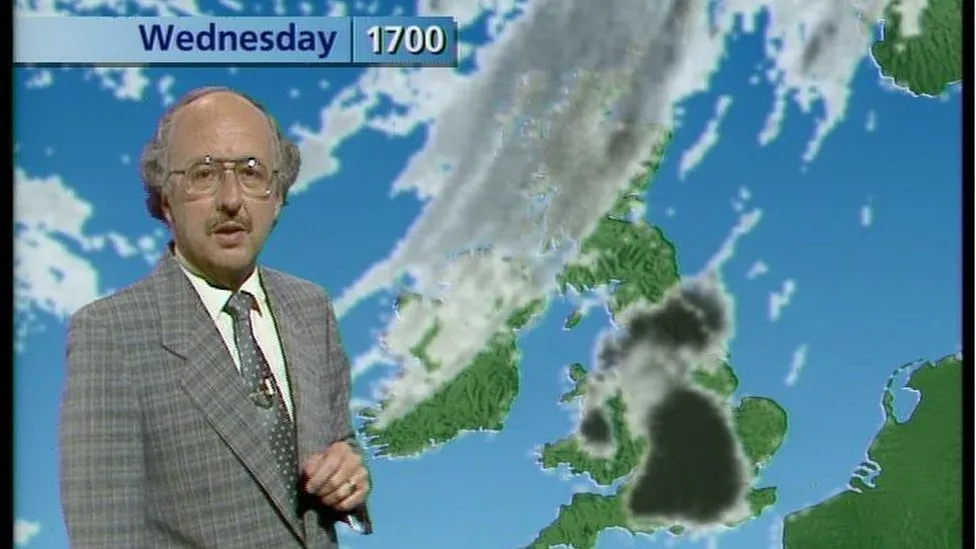

# Project Presentation 
# How are you feeling today... John Kettley 🌧️ or Michael Fish🌞?
 
# OR 

## Overview!

In this kata, create a function that determines if you are in a John Kettley, Michael Fish or confused mood based on the weather forecast. 

For those who remember the weathermen, John Kettley and Michael Fish, you're blessed; for those who don't, you should definitely go and checkout this chart topping song from 1988 by 'A Tribe Called Toffs' - John Kettley (is a weatherman).
<video controls src="A Tribe of Toffs - John Kettley is a Weatherman.mp4" title="Title"></video>
## Problem Statement

Users need to implement a function `kettleyOrFish` that takes two inputs: `temperature` (a number) and `forecast` (a string). The function should return:
- "Kettley" if it's cold and rainy 
- "Fish" if it's warm and sunny 
- "Confused" if the conditions don’t match these scenarios like cloudy 

## Instructions for Participants
### 🌧️🌞 Hello Weather Lovers (or Haters)! 🌞🌧️

Welcome to the wonderful world of weather! Your task is to write a function called `kettleyOrFish`.  

John Kettley is a famous British weatherman known for predicting rain (🌧️), and Michael Fish is known for
getting it wrong sometimes (🌤️). Depending on the forecast, you need to decide if you're more of a Kettley (expecting rain) or a Fish (expecting sunshine)... or simply Confused

### Here's the forecast:
- Only if the temperature is below 15°C and the forecast mentions "rain", you're feeling more like John Kettley. Return "Kettley".
- Only if the temperature is above and equal to 15°C and the forecast mentions "sunshine", you're channeling your inner Michael Fish. Return "Fish".
- If it's any other weather state, irrespective of the temperature, you're a bit confused, so just return "Confused".
- If the temperature and weather conditions go against the Kettley and Fish rules, surely you're "Confused", e.g. "rain" and 15°C or above. 

### Examples:
- kettleyOrFish(10, "rain") ➞ "Kettley"
- kettleyOrFish(20, "sunshine") ➞ "Fish"
- kettleyOrFish(15, "cloudy") ➞ "Confused"
- kettleyOrFish(25, "rain") ➞ "Confused"  

Your implementation should handle temperatures between -30°C and 50°C and common weather descriptions like "rain", "sunshine", "cloudy", etc.
 
- Write a function `kettleyOrFish(temperature, forecast)` that returns the appropriate weatherman or confused state based on the given conditions.
- The temperature will be an integer between -30 and 50.
- The forecast will be a string like "rain", "sunshine", "cloudy", etc.
